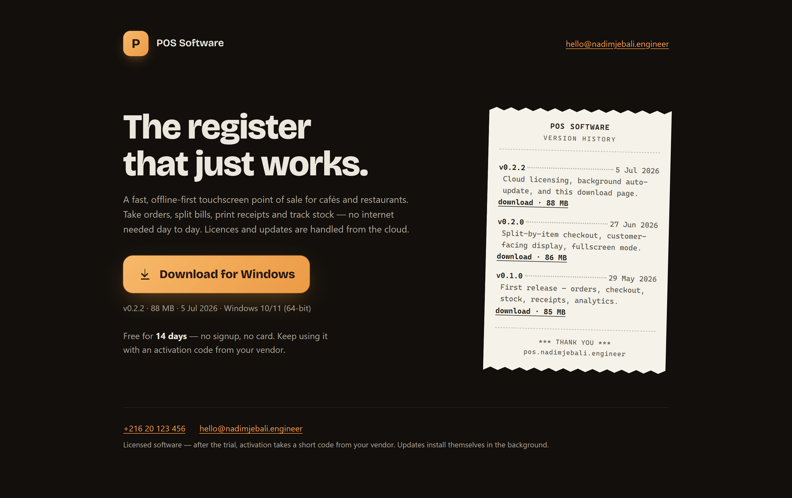
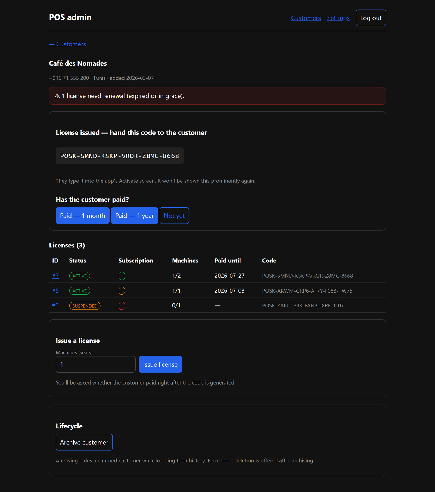

# POS-platform

License server, customer registry, and update feed for [POS Software](https://github.com/NadimJebali/POS-software).

Node.js + SQLite (`node:sqlite`, no native build) behind Caddy, deployed with Docker
Compose on a single droplet. The POS app runs fully offline day-to-day; it only talks
to this server to **activate** and to **renew** its short-lived, machine-bound license.

**Live:** [pos.nadimjebali.engineer](https://pos.nadimjebali.engineer)



## Status

**Live in production.** Activation, renewal, self-service rebind, the admin panel, the
public download page, and the auto-update feed are all deployed — Docker Compose +
Caddy auto-TLS on a DigitalOcean droplet, with GitHub Actions CI/CD (build → Docker Hub
→ droplet pull) and Terraform-managed infrastructure. Per-IP rate limiting protects the
public endpoints.

The POS app's side of the integration (activate-by-code, silent background renewal,
rebind, and background auto-update) ships in the
[POS-software](https://github.com/NadimJebali/POS-software) repo. What remains is purely
operational hardening on the droplet — nightly off-droplet backups + a rehearsed restore
drill (see [`DEPLOY.md`](DEPLOY.md) §6).

## Admin panel

Server-rendered HTML under `/admin`, single account. Set `ADMIN_PASSWORD_HASH`
(`npm run hash-password -- 'your password'`) and log in at `/admin/login`. From there:

- Create customers (minimal PII) and search them.
- Issue licenses (the activation code is shown once, to hand over).
- On a license: record payments (month/year, appended to a ledger from which
  `paid_until` is derived), suspend/unsuspend, revoke (confirmed, permanent), and
  manually unbind a machine to free a seat.
- Edit global settings (renewal window, grace days, transfer limit, warn days) — they
  take effect on each client's next renewal, no app update needed.

The session is an httpOnly cookie; login is rate limited. Issuing a code prompts
"Has the customer paid?" so the subscription starts in the right state; billing status
(active / expiring / grace / lapsed / never-paid) shows at a glance.



## Public download page & update feed

`GET /` is a public, server-rendered download page — **off by default**, enabled in
**Admin → Settings**. It shows a "Download for Windows" button for the latest build and
a version history (styled as a printed receipt), both read from `releases.json` in the
updates directory. Content (product name, tagline, description, contact) is editable in
settings.

`/updates/*` is a static feed (installers + `latest.yml`) the POS app polls for
background auto-updates. The vendor publishes to it from the POS-software repo
(`npm run publish:update`), which uploads the installer, the `latest.yml` metadata (with
SHA-512), and appends the release to `releases.json`. No authentication; update checks
never touch the licensing endpoints.

## Requirements

- Node.js >= 22.5 (uses the built-in `node:sqlite`; developed on Node 24)

## Getting started

```bash
npm install
npm run keygen          # generate an Ed25519 keypair
cp .env.example .env    # paste the printed LICENSE_PRIVATE_KEY into it
node --env-file=.env src/server.js
```

Run the tests (no network, in-memory DB, throwaway keypair):

```bash
npm test
```

## API

### `POST /activate`

Bind a machine to a license and receive a signed license key.

Request:

```json
{ "code": "POSK-XXXX-XXXX-XXXX-XXXX-XXXX", "machineId": "ABCD-1234-EF56", "appVersion": "0.2.0" }
```

Success `200`: `{ "license_key": "<base64payload>.<base64sig>", "exp": 1750000000000 }`

Errors (each has a stable `error` code): `invalid_code` (404), `suspended` /
`revoked` (403), `machine_limit` (409, license already on another machine — the app
offers rebind), `bad_request` (400).

### `POST /renew`

Exchange the current signed key for a fresh one. Self-authenticating: the server
verifies the presented key against its own public key, so there is no client secret.
The presented key's expiry is **not** checked — a long-offline machine with a genuine
but expired key still renews if its license is in good standing (offline gap recovery).

Request:

```json
{ "license_key": "<current key>", "machineId": "ABCD-1234-EF56", "appVersion": "0.2.0" }
```

Success `200`: `{ "license_key": "<fresh key>", "exp": 1750000000000, "graceUntil": null }`.
When the subscription has lapsed but is within the grace window, `graceUntil` is set
(epoch ms) — the renewal still succeeds so the register keeps working, and the app
shows a "please renew" banner.

Errors: `invalid_key` (401, bad/forged signature or unknown license), `machine_mismatch`
(403), `unbound` (403, machine rebound away), `suspended` / `revoked` (403), `lapsed`
(403, past the grace window). `paid_until` is derived from the append-only payments
ledger, never stored.

### `POST /rebind`

Move a license onto a new machine (the "my PC died" flow — the app calls this after
an activation reports `machine_limit`). Frees the oldest seat, binds the new machine,
and counts against the yearly transfer limit; the old machine can no longer renew.

Request: `{ "code": "POSK-…", "machineId": "NEW-MACHINE", "appVersion": "0.2.0" }`

Success `200`: same shape as activate. Errors: `invalid_code` (404), `suspended` /
`revoked` (403), `transfer_limit` (429 — the app shows "contact the vendor"). Rebinding
onto an already-bound machine, or when a seat is free, succeeds without spending a
transfer.

## License format

`<base64(payloadJson)>.<base64(ed25519 signature over the base64 string)>`. This is
the exact format the POS app verifies offline; `test/license-format.test.js` is a
contract test that guards it against drift. **Never** change the signing details
without updating the app's verifier in lockstep.

## Deployment

`docker compose up -d` on the droplet after populating `.env` (`LICENSE_PRIVATE_KEY`,
`DOMAIN`). Caddy handles TLS for `$DOMAIN`. SQLite persists on a named volume.

## Security

- The private signing key lives only in the server's environment — never in git,
  never in the shipped app. `.gitignore` blocks `.env` and `*.pem`.
- All policy (renewal window, grace days, transfer limit) lives in the `settings`
  table and is read at runtime — changing it never requires an app release.
